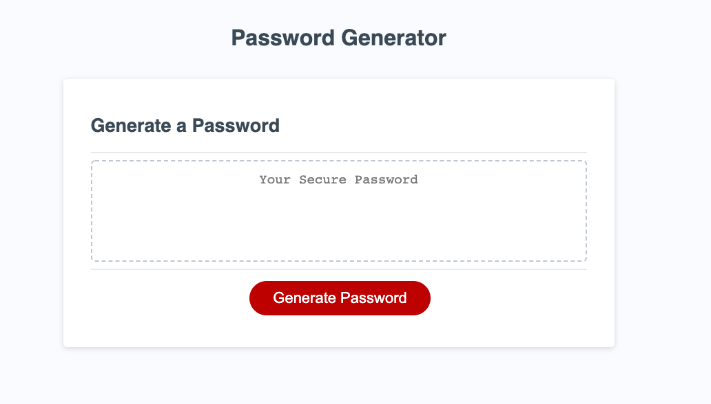

# gt-hw3-password-generator

## Description

This program takes a user's desired password length and criteria and outputs a randomized and secure password for protecting themselves and their information.

## Installation

Clone the repo and run the index.html in your browser.

## Usage

This application is perfect for those who need to secure their information with an array (haha!) of different and secure passwords. Once you open the app, click on the button to have the browser prompt you to select your desired length (8-128 characters) and select at least one character type. You will then be alerted with your secure password.

## Credits

This was a solo project completed as homework for the Georgia Tech Full-Stack Flex Program. As always, many thanks to my peers who are always willing to work out the kinks together.

## License

MIT License

Copyright (c) [2020][maya stucky]

Permission is hereby granted, free of charge, to any person obtaining a copy
of this software and associated documentation files (the "Software"), to deal
in the Software without restriction, including without limitation the rights
to use, copy, modify, merge, publish, distribute, sublicense, and/or sell
copies of the Software, and to permit persons to whom the Software is
furnished to do so, subject to the following conditions:

The above copyright notice and this permission notice shall be included in all
copies or substantial portions of the Software.

THE SOFTWARE IS PROVIDED "AS IS", WITHOUT WARRANTY OF ANY KIND, EXPRESS OR
IMPLIED, INCLUDING BUT NOT LIMITED TO THE WARRANTIES OF MERCHANTABILITY,
FITNESS FOR A PARTICULAR PURPOSE AND NONINFRINGEMENT. IN NO EVENT SHALL THE
AUTHORS OR COPYRIGHT HOLDERS BE LIABLE FOR ANY CLAIM, DAMAGES OR OTHER
LIABILITY, WHETHER IN AN ACTION OF CONTRACT, TORT OR OTHERWISE, ARISING FROM,
OUT OF OR IN CONNECTION WITH THE SOFTWARE OR THE USE OR OTHER DEALINGS IN THE
SOFTWARE.

## URL

<a href = "https://mayastucky.github.io/gt-hw3-password-generator/">Link to Deployed Site</a>

<a href = "https://github.com/mayastucky/gt-hw3-password-generator">Link to GitHub Repo</a>
